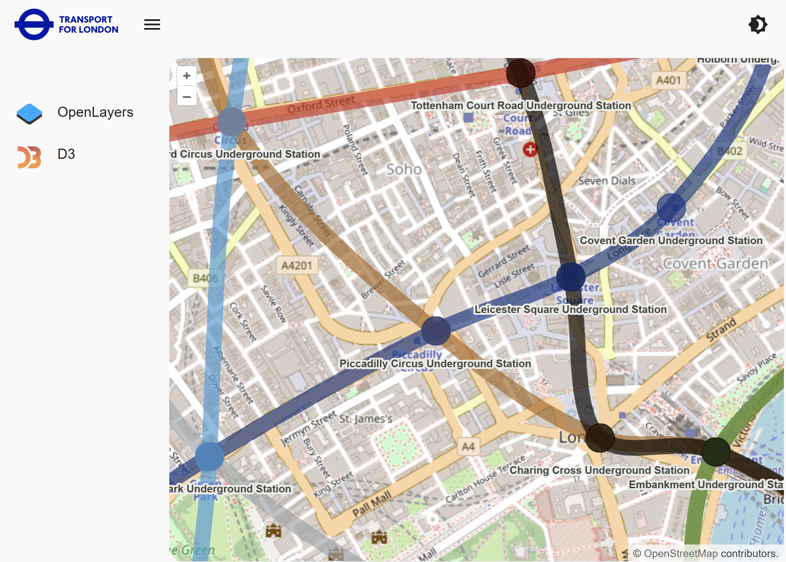
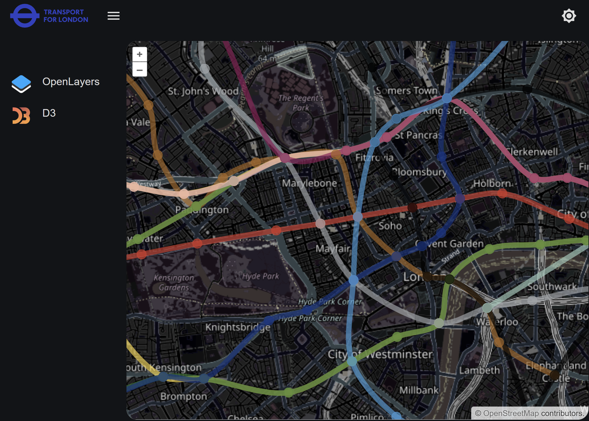
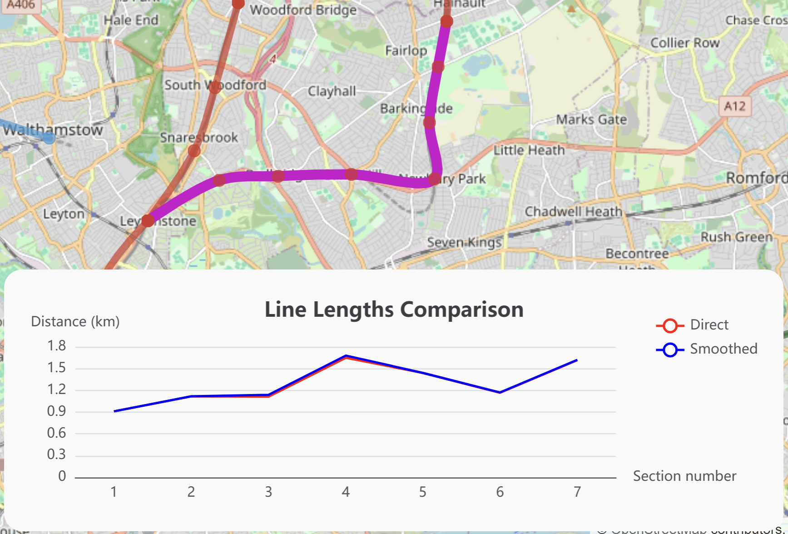
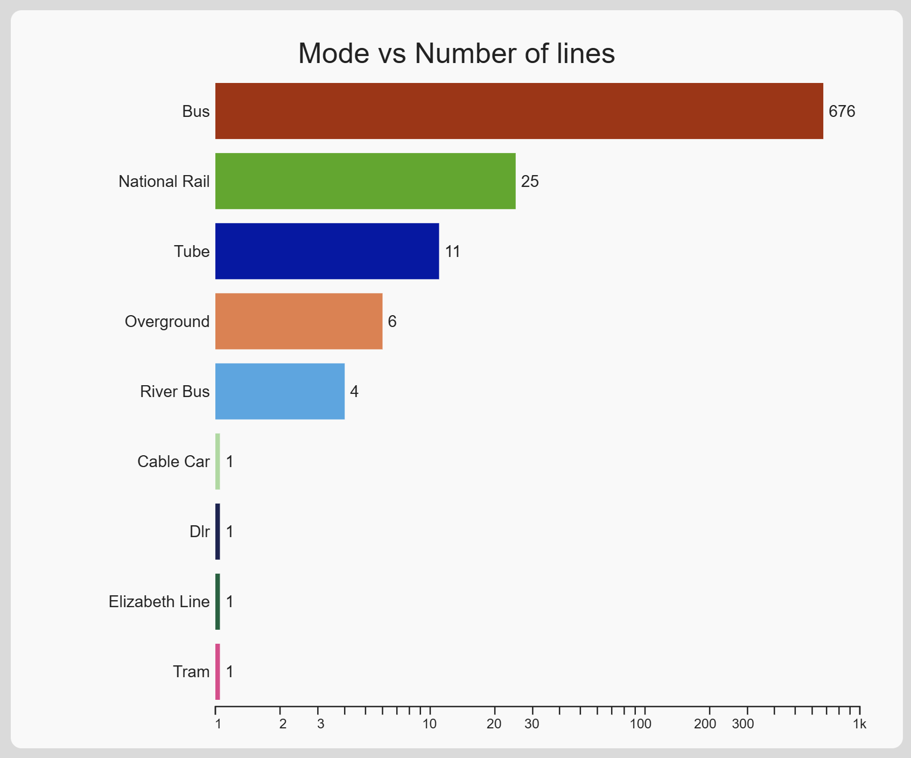
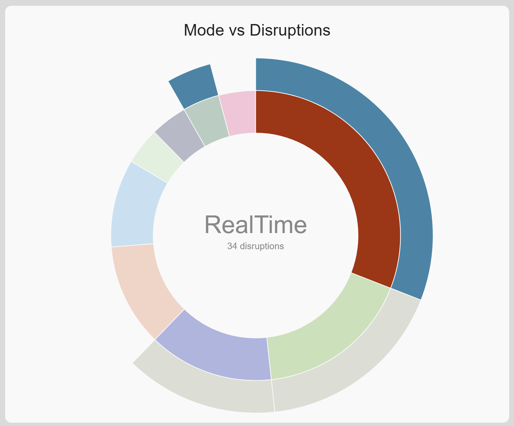

# PetLondon

Interactive map of London's tube lines and charts about London's transport network from the [TfL Unified API](https://api.tfl.gov.uk/), built with React 19, TypeScript, OpenLayers, D3 and ECharts.

**Live demo:** https://teodorro.github.io/petlondon/







## Features

- **Tube map** (OpenLayers): Underground lines drawn as smoothed Catmull-Rom curves. Curves pass through their real station coordinates. The map has a light/dark basemap that follows the app theme.
- **Line length chart** (ECharts): click a line on the map to compare direct station-to-station distances against the smoothed route geometry.
- **Lines per mode** (D3): log-scale bar chart of how many lines each transport mode runs.
- **Disruption sunburst** (D3): current disruptions by transport mode and category, sized by a log scale of each mode's line count.
- **Works without the API**: all TfL responses are cached in `localStorage` and a full data snapshot ships with the app, so the demo renders even when the TfL API is unreachable. See the next section for how to switch to live data.

## Data sources & offline mode

The TfL API is not reachable from every network (in some countries it requires a VPN), so the app has a layered data strategy:

1. **Live TfL API** — fresh data when reachable.
2. **`localStorage` cache** — every successful response is persisted (TanStack Query persister) and reused on later visits.
3. **Bundled snapshot** — `public/tfl-data/` holds a committed copy of all the data the app needs, used when the API can't be reached at all.

The mode is controlled by `VITE_DATA_SOURCE` in `.env` / `.env.local`:

| Value   | Behaviour                                         |
| ------- | ------------------------------------------------- |
| `local` | Always use the bundled snapshot (current default) |
| `tfl`   | Always query TfL; fail if unreachable             |
| unset   | Query TfL, fall back to the snapshot on failure   |

Refresh the snapshot from the live API (VPN on, if you need one) with:

```sh
npm run snapshot
```

## Getting started

Requires Node 22 (matches CI).

```sh
npm ci
npm run dev       # dev server (app is served under /petlondon/)
npm test          # vitest
npm run lint      # eslint
npm run build     # type-check + production build to dist/
```

No API keys needed — `.env` already points at the public TfL API.

## Tech stack

React 19 · TypeScript · Vite · TanStack Query (+ persist) · Zustand · OpenLayers · D3 · ECharts · MUI · Turf.js · Vitest · Testing Library · ESLint + Prettier + Husky

## Deployment

Pushing to `main` runs lint, tests, and build, then deploys to GitHub Pages via GitHub Actions (`.github/workflows/deploy.yml`). Pull requests get the same checks without deploying (`ci.yml`). The app is built with `base: /petlondon/` for the project-page URL.

---

Powered by TfL Open Data. Contains OS data © Crown copyright and database rights 2016. Map tiles © [OpenStreetMap](https://www.openstreetmap.org/copyright) contributors.
